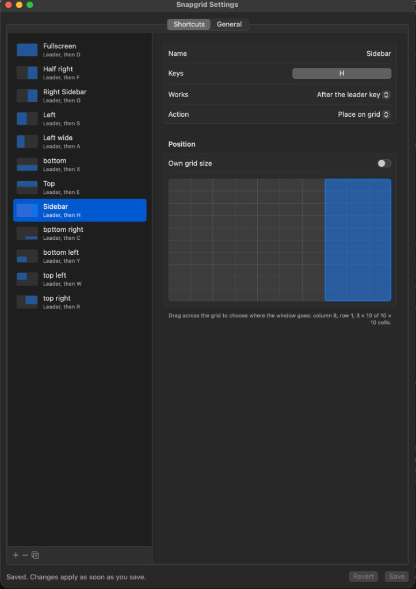
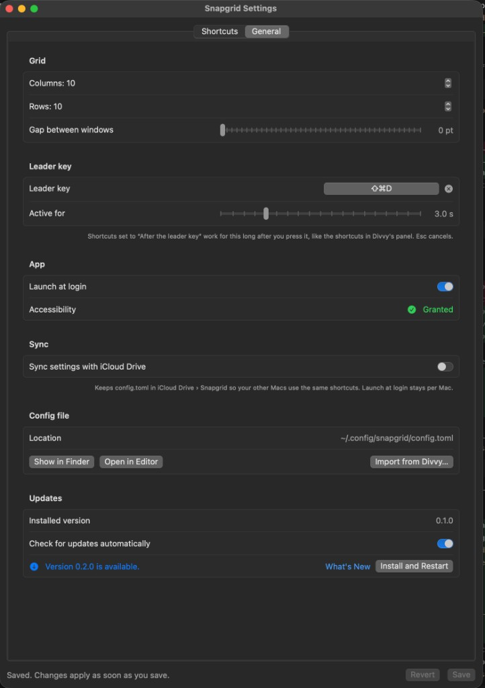
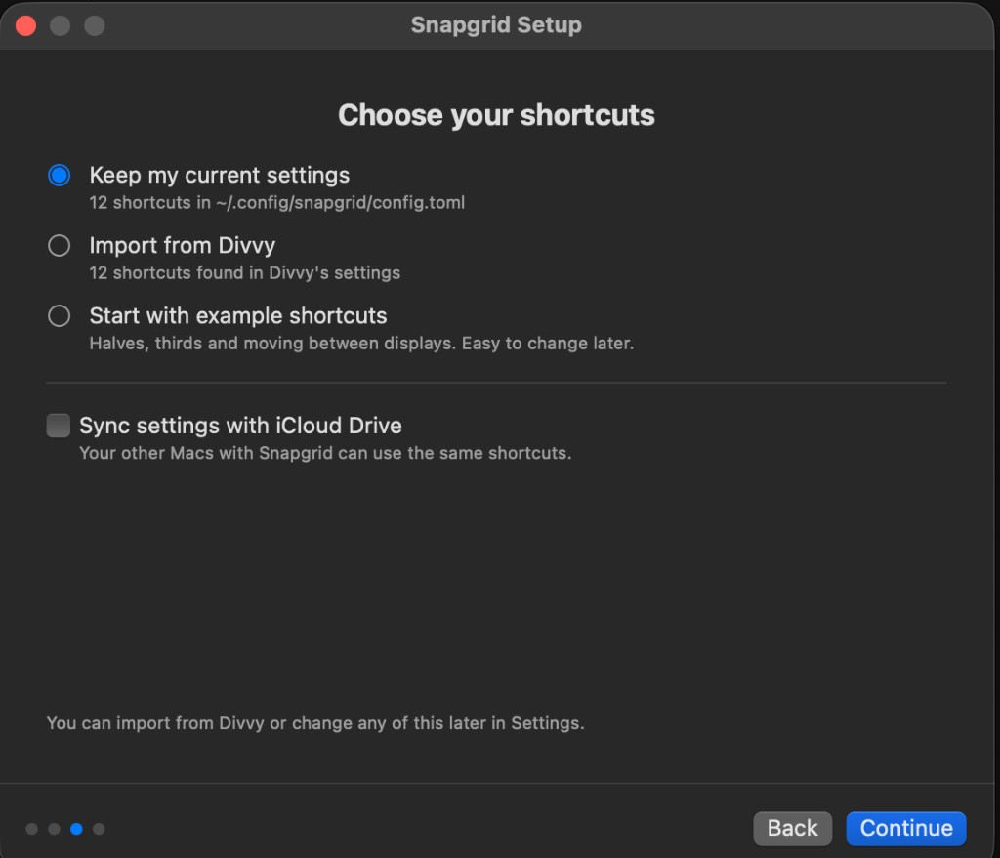
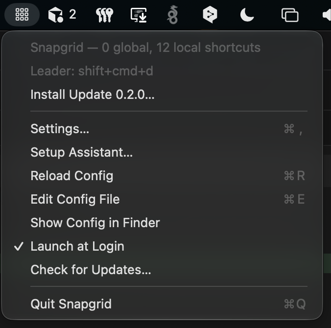
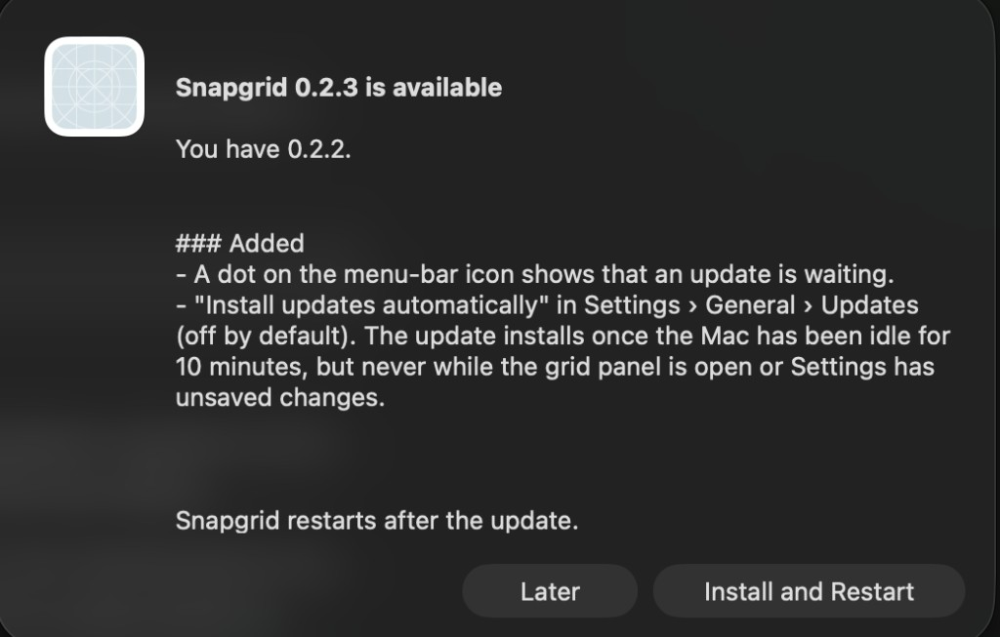

# Snapgrid

A small, dependency-free replacement for [Divvy](https://mizage.com/divvy/) on macOS. It places the focused window on a grid using global keyboard shortcuts, and everything is configured in one TOML file.

## Why Snapgrid?

Divvy was the best grid window manager on the Mac, but it appears to be no longer maintained. It never got an Apple Silicon version and only runs through Rosetta, which Apple is phasing out after macOS 27, so Divvy will stop working. Snapgrid keeps Divvy's workflow (the leader-key panel, drag-to-place grid and plain-key shortcuts) and imports your existing Divvy shortcuts, so switching takes a minute.

## Features

- Native arm64 (Apple Silicon), macOS 13 or later, built for macOS 27+.
- Only Apple frameworks are used: AppKit, SwiftUI, Accessibility (`AXUIElement`), Carbon `RegisterEventHotKey` and ServiceManagement. There are no third-party packages.
- Divvy-style grid shortcuts, with a grid size per shortcut, a gap between windows, separate screen margins, and moving windows to the next or previous display.
- **Divvy's panel:** press the **leader key** and a translucent grid appears over the focused window's display. Drag across it and release to place the window there, or press one of Divvy's *local* shortcuts (plain keys such as `l`). The + and − buttons below the grid change its columns and rows, and the panel remembers that size. With several displays, pressing the leader key again moves the panel to the next display, and the window goes where the panel is; after the last display it closes. Esc or a click elsewhere closes it too. The gear at its top right opens Settings.
- Imports your existing Divvy shortcuts with `snapgrid import-divvy`.
- Runs as a menu-bar item (no Dock icon) with Settings, Reload, Edit Config File, Launch at Login and Quit. The config reloads automatically when you save it.
- A **Settings** window (menu bar › Settings…, or open the app again) edits everything without touching the file: record shortcuts, drag across a grid to choose where the window goes, and set the grid, gap, leader key and launch at login. It also imports from Divvy and shows Accessibility status and shortcuts another app already uses.
- A **setup assistant** on first launch (and later under menu bar › Setup Assistant…) walks through Accessibility permission, then lets you keep your config, import from Divvy, use settings from iCloud Drive, or start with the examples.
- **Sync with iCloud Drive** (Settings › General) moves `config.toml` to iCloud Drive › Snapgrid and leaves a symlink at `~/.config/snapgrid/config.toml`, so the CLI and editors work as before. Edits from another Mac reload automatically. Apple's iCloud key-value store would need an iCloud entitlement, which requires a paid developer account; iCloud Drive doesn't.

## Screenshots

<p align="center">
  
  
</p>
<p align="center">
  
  
</p>

## Download

1. Download `Snapgrid-<version>.zip` from the [latest release](https://github.com/smee-dee/snapgrid/releases/latest), unzip it, and move `Snapgrid.app` to Applications.
2. Open it. The first time, macOS says it can't verify the developer. Go to System Settings › Privacy & Security, click **Open Anyway**, and confirm. This is only needed once; later updates install from inside the app.
3. The setup assistant walks you through Accessibility permission and your shortcuts.

## Build from source

You need Xcode or the Command Line Tools (for `swift`).

```bash
git clone https://github.com/smee-dee/snapgrid.git && cd snapgrid
swift test                                 # optional: run the unit tests
SIGN_IDENTITY="Apple Development: you@example.com (TEAMID)" scripts/build-app.sh --install
```

`--install` copies `Snapgrid.app` to `/Applications`, links the `snapgrid` CLI into `/opt/homebrew/bin` (or `~/.local/bin`), and launches the app.

- **Accessibility:** On first launch, macOS asks for Accessibility access. This is required to move other apps' windows. Enable Snapgrid under System Settings › Privacy & Security › Accessibility.
- **Signing:** macOS ties that permission to the code signature. With a stable `SIGN_IDENTITY`, the grant survives rebuilds. Without one, the script signs ad-hoc and you must re-grant after every rebuild. A free Apple Development certificate (Xcode › Settings › Accounts) is enough. Run `security find-identity -v -p codesigning` to list yours. Notarization is only needed if you distribute the app to other people.
- **Launch at login:** Use the menu-bar item's "Launch at Login" option, which uses `SMAppService`.
- **Tests without Xcode selected:** The Command Line Tools don't include XCTest. Run `DEVELOPER_DIR=/Applications/Xcode.app/Contents/Developer swift test`. If the repo is in an iCloud-synced folder such as `~/Documents`, add `--scratch-path ~/Library/Caches/snapgrid-build`, because codesign rejects the file attributes iCloud adds.

## Share a build and publish updates

Releases are published on GitHub, and the app updates itself from them:

1. Bump `static let version` in `Sources/snapgrid/CLI.swift`, move the `## [Unreleased]` entries in [`CHANGELOG.md`](CHANGELOG.md) under a new `## [<version>] - <date>` heading, and commit.
2. Run `SIGN_IDENTITY="Apple Development: …" scripts/release.sh`. The release notes come from that changelog section. It needs the GitHub CLI (`gh auth login`) and `origin` pointing at the GitHub repo. It pushes to `main` on GitHub, builds and signs `Snapgrid-<version>.zip`, and publishes release `v<version>` with the zip attached.
3. Installed copies notice the release within a day, or right away with menu bar › Check for Updates…. A dot on the menu-bar icon shows that an update is waiting. With "Install updates automatically" on (Settings › General, off by default), it installs once the Mac has been idle for 10 minutes, but never while the grid panel is open or Settings has unsaved changes.

   
 **Install and Restart** downloads the zip and installs it only if it's signed by the same team as the running app. Accessibility permission carries over, and nothing is re-quarantined, so there's no Gatekeeper prompt after the first install.

Always release with the same certificate. The repo the app checks is written into `Info.plist` at build time: the `origin` remote, or `UPDATE_REPO=owner/repo`. Builds without one simply have no update button. `scripts/build-app.sh --zip` alone writes the zip without publishing it. Don't commit binaries to git: they bloat the history and go stale.

People who receive a zip signed with an Apple Development certificate will see macOS block it the first time, because only Developer ID builds that Apple has notarized open without a warning. They can allow it once under System Settings › Privacy & Security › "Open Anyway", or run `xattr -dr com.apple.quarantine /Applications/Snapgrid.app`. Then they grant Accessibility as usual. To avoid the warning entirely you need a paid Apple Developer account, a "Developer ID Application" identity, and `xcrun notarytool submit … --wait` followed by `xcrun stapler staple`.

## Migrate from Divvy

On the Mac where Divvy is set up:

```bash
snapgrid import-divvy            # reads Divvy's prefs, writes ~/.config/snapgrid/config.toml
snapgrid check                   # review what was imported
snapgrid reload                  # or just save the file; the app picks it up
```

- **Where it reads from:** The importer reads `defaults export com.mizage.direct.Divvy` (the direct download) or `com.mizage.Divvy` (the App Store build). To convert a plist copied from another machine, use `--plist FILE`. To preview without writing anything, use `--output -`.
- **What it converts:**
  - Each Divvy shortcut becomes a `[[shortcut]]` entry with the same grid size, selection and key.
  - Keys are named according to your current keyboard layout.
  - Divvy local shortcuts get `global = false`, and the hotkey that opened the Divvy panel becomes the `leader`.
  - Divvy's default grid becomes `grid`, and its margins (if turned on) become `gap` and `margin`.
- **What it leaves commented out, with a `# NOTE:`:** disabled shortcuts, duplicate keys, and selections on a subdivided grid that need checking.
- **Privacy:** Divvy's preferences also contain your licence key. The importer only lists the names of other settings and never copies their values.

## Config reference

`~/.config/snapgrid/config.toml` (or `$XDG_CONFIG_HOME/snapgrid/config.toml`). Run `snapgrid init` to create the starter file shown in [`config.example.toml`](config.example.toml).

```toml
[settings]
grid = "6x6"              # default grid, columns x rows
gap = 0                   # points between windows (and at the screen edges unless margin is set)
margin = "10 20"          # optional screen edges: 10, "10 20" (top/bottom, sides) or "top right bottom left"
leader = "ctrl+alt+space" # arms local shortcuts (optional)
leader_timeout = 3        # seconds they stay armed when show_grid = false
show_grid = true          # leader key opens Divvy's click-and-drag grid (default)

[[shortcut]]
name = "Left two thirds"  # optional, shown in `snapgrid check` and error messages
keys = "ctrl+alt+e"
grid = "3x1"              # optional, overrides [settings] grid
cells = "0,0 2x1"         # col,row of top-left cell (0-based), then width x height in cells
global = true             # default; false = only after the leader key

[[shortcut]]
keys = "ctrl+alt+cmd+right"
action = "next-screen"    # or "previous-screen"; keeps relative size and position
```

- **Keys:** Modifiers are `ctrl`, `alt`/`option`, `shift` and `cmd`, followed by one key: a letter, digit or symbol as labelled on your keyboard, `left` `right` `up` `down`, `return`, `space`, `tab`, `escape`, `delete`, `home`, `end`, `pageup`, `pagedown`, `f1`–`f20`, `pad0`–`pad9`, `plus`, `minus`, or `keycode:<n>` for a raw key code.
- **Global shortcuts need a modifier** (F-keys excepted), so a plain key is never swallowed system-wide.
- **Validation:** Mistakes are reported with line numbers. The running app keeps the last good config if a reload fails, and the menu shows the error and any shortcut that macOS refused to register because another app already uses it.

## CLI

```
snapgrid run [--config PATH]      run in the foreground (logs to stderr; handy for debugging)
snapgrid check [--config PATH]    validate and list shortcuts
snapgrid init [--force]           write the starter config
snapgrid import-divvy [--plist FILE] [--output PATH|-] [--force]
snapgrid reload                   tell the running app to reload
```

If `run` is started from a terminal, macOS attributes the Accessibility permission to the terminal app. For daily use, launch `Snapgrid.app` instead.

## Layout

```
Sources/SnapgridCore/   platform-independent: TOML subset parser, config model, key parsing,
                        grid geometry, Divvy importer (unit-tested, also builds on Linux)
Sources/snapgrid/       macOS app + CLI: Carbon hotkeys, AX window moves, keyboard layout, menu bar,
                        SwiftUI settings window (SettingsModel.swift, SettingsView.swift)
Tests/                  XCTest suite for the core
scripts/build-app.sh    builds and signs Snapgrid.app (--install, --zip)
scripts/release.sh      publishes a GitHub release that installed copies update from
```
